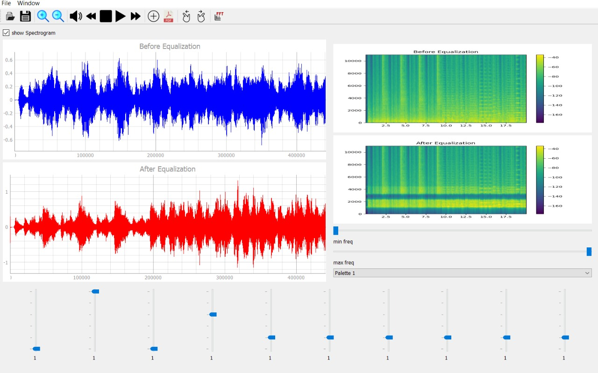
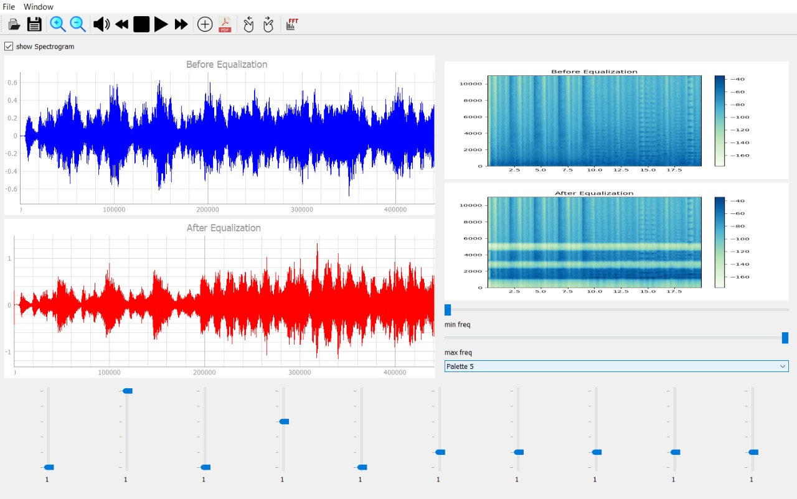

# Sound-Equalizer
- Sound equalizer is a basic tool in the music industry. It also serves in several biomedical applications like hearing aid industry.
 
## About the app :
- You can open a signal and apply some options on it like:
   * Zooming in or out
   * play / pause sound
   * moving forward or backward within the signal
   * to delete current signal to addanother one
- Each signal has its own spectrogram beside it which you can adjust the spectrogram using:
   * sliders of minimum and maximum value of shown spectrum 
   * chaning the color palet

- There are 10 sliders to change the gain (0:10) of a specific bandwidth and changing any of them would change the output signal besides its spectrogram and it would be played.
- You can open more than window with same interface and options.
- You can save final both signals ( before & after ) with their spectrograms in a *pdf*  file format as well as saving modified signal in *.wav* file.

***

It was a team project done by:

[Marwa Abdelaal](https://github.com/MarwaAbdelAal), 
[Meirna Kamal](https://github.com/Meirna-kamal), 
[Nada Ezzat](https://github.com/nadaezzat-99), 
[Noura Mahmoud](https://github.com/Noura-Mahmoud)